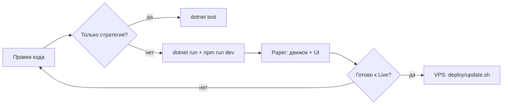

# Локальная разработка и тестирование

Подробная инструкция: как запускать Poly Trader на своей машине, тестировать изменения **без** деплоя на VPS после каждого коммита.

Связанные документы:

| Документ | Когда читать |
|----------|----------------|
| [README.md](README.md) | Обзор стека и API |
| [RUN_OPERATOR.md](RUN_OPERATOR.md) | Переменные окружения, Telegram, phased rollout Live |
| [DEPLOY.ru.md](DEPLOY.ru.md) | Продакшен на VPS |
| [deploy/OPERATIONS.ru.md](deploy/OPERATIONS.ru.md) | Эксплуатация на сервере (`git pull`, `update.sh`) |
| [docs/ENTRY_MECHANISM.ru.md](docs/ENTRY_MECHANISM.ru.md) | Механизм входа в сделку |

---

## Зачем локальный запуск

Типичная ошибка — проверять каждое изменение только на проде:

```
git push → SSH на VPS → git pull → deploy/update.sh
```

Это медленно, рискованно (Live + реальные деньги) и смешивает отладку с боевой БД.

**Рекомендуемый цикл:**

1. Разработка и UI — локально (`dotnet run` + `npm run dev`).
2. Логика стратегии — `dotnet test` (без ожидания 5‑минутных свечей).
3. Интеграция в Paper — локальный движок на симуляции.
4. VPS — только когда Paper стабилен или нужен осознанный Live‑тест / проверка Docker.



---

## Требования

| Компонент | Версия |
|-----------|--------|
| .NET SDK | **10** (`dotnet --version`) |
| Node.js | **20+** (`node --version`) |
| Git | любая актуальная |

Опционально: **Docker Desktop** — если нужно проверить сборку как на VPS (nginx + compose).

---

## Первоначальная настройка (один раз)

### 1. Клонировать репозиторий

```powershell
cd C:\All\Develop
git clone <url> poly-trader
cd poly-trader
```

### 2. Файл `.env`

```powershell
copy .env.example .env
```

Отредактируйте `.env` в корне репозитория. API и Vite читают **один и тот же** файл:

- API: `EnvFileLoader` при `dotnet run` ([`src/PolyTrader.Api/EnvFileLoader.cs`](src/PolyTrader.Api/EnvFileLoader.cs))
- UI: `envDir` в [`client/vite.config.ts`](client/vite.config.ts) указывает на корень репо

**Для удобной локальной разработки** (не обязательно):

```env
WEB_API_TOKEN=dev-secret
VITE_API_TOKEN=dev-secret
POLYTRADER_LOG_LEVEL=Debug
```

Тогда UI не будет каждый раз спрашивать токен. В продакшене **`VITE_API_TOKEN` оставляют пустым** — токен вводят в браузере.

**Для безопасного теста** ключи Polymarket можно **не задавать** — работайте в режиме **Paper**.

### 3. Зависимости фронтенда

```powershell
cd client
npm install
cd ..
```

---

## Основной режим: API + Vite (самый быстрый)

Два терминала из корня проекта.

### Терминал 1 — бэкенд

```powershell
cd src\PolyTrader.Api
dotnet run
```

| Параметр | Значение |
|----------|----------|
| URL API | http://localhost:5088 |
| Swagger | http://localhost:5088/swagger |
| Окружение | `Development` ([`launchSettings.json`](src/PolyTrader.Api/Properties/launchSettings.json)) |
| SQLite | `src\PolyTrader.Api\polytrader.db` (локальная, **не** прод) |
| Логи | `logs\polytrader-YYYYMMDD.log` (каталог `POLYTRADER_LOG_DIR`, по умолчанию `logs` в корне) |

После смены `.env`, `WEB_API_TOKEN`, Telegram или Polymarket — **перезапустите** `dotnet run`.

### Терминал 2 — фронтенд

```powershell
cd client
npm run dev
```

| Параметр | Значение |
|----------|----------|
| URL UI | http://127.0.0.1:5173 |
| Прокси | `/api` и `/hubs` → `http://127.0.0.1:5088` |

**`VITE_API_URL` для локального dev не нужен** — пустая строка, запросы идут на тот же origin, Vite проксирует на API.

### Что перезагружается при правках

| Изменили | Действие |
|----------|----------|
| `client/src/*` | Сохранить — HMR Vite |
| C# без DI / миграций | Сохранить — `dotnet watch` или перезапуск `dotnet run` |
| `.env`, ключи, токен API | Перезапуск API |
| EF-миграции | Перезапуск API (миграции применяются при старте) |

Удобно для API:

```powershell
cd src\PolyTrader.Api
dotnet watch run
```

---

## Режим Paper (рекомендуется для dev)

1. Откройте http://127.0.0.1:5173
2. В настройках движка: режим **Paper**, включите **Running**
3. Наблюдайте сделки, пропуски, баланс paper-счёта

Paper использует ту же логику сигналов и settlement, что и Live, но **без** ордеров на CLOB.

Пошаговый вывод в Live — [RUN_OPERATOR.md](RUN_OPERATOR.md#phased-rollout):

1. Paper soak (дни)
2. Live dry-run (ключи есть, движок **остановлен**)
3. Live micro ($1, 1–2 окна)
4. Масштабирование

На локальной машине обычно достаточно шагов **1–2**. Шаги 3–4 — осознанно, с малым стейком, и часто на VPS.

---

## Автотесты (стратегия и ядро)

Без запуска сервера и без ожидания свечей:

```powershell
cd C:\All\Develop\poly-trader
dotnet test
```

Проект: [`tests/PolyTrader.Core.Tests/`](tests/PolyTrader.Core.Tests/) — golden-тесты blend_fade2, правила входа, condition id и т.д.

Запускайте после изменений в:

- `src/PolyTrader.Core/`
- `client/src/utils/chart/blendFade2Signals.ts` (должен оставаться в паритете с бэкендом)

---

## Docker локально (как на VPS, но на своём ПК)

Когда нужно проверить **Dockerfile**, `docker-compose.yml`, nginx в контейнере web — не для каждой правки UI.

```powershell
cd C:\All\Develop\poly-trader
copy .env.example .env
# отредактировать .env; VITE_API_URL оставить пустым
docker compose up --build
```

| Сервис | URL |
|--------|-----|
| API | http://localhost:5088 |
| UI | http://localhost:8080 (nginx проксирует `/api`, `/hubs`) |

SQLite в Docker volume `polytrader-data` — **отдельно** от `polytrader.db` при `dotnet run`.

Остановка:

```powershell
docker compose down
```

Продакшен на VPS использует ещё [`docker-compose.prod.yml`](docker-compose.prod.yml) — см. [DEPLOY.ru.md](DEPLOY.ru.md).

---

## Логи и отладка

### Хвост лога (PowerShell)

```powershell
Get-Content .\logs\polytrader-*.log -Wait -Tail 50
```

### Уровень детализации

В `.env`:

```env
POLYTRADER_LOG_LEVEL=Debug
```

Перезапуск API. В Development также включён Debug в [`appsettings.Development.json`](src/PolyTrader.Api/appsettings.Development.json).

### Проверка API без UI

```powershell
# без токена, если WEB_API_TOKEN пуст
curl http://localhost:5088/api/health/connectivity

# с токеном
curl -H "Authorization: Bearer dev-secret" http://localhost:5088/api/engine
```

### Live без реальных ордеров

Задайте ключи Polymarket, проверьте:

```text
GET /api/engine/live-status
GET /api/health/connectivity
```

Движок **не запускайте** (или режим Paper) — баланс и `clob: OK` без сделок.

---

## Что тестировать где

| Тип изменения | Локально | VPS (`deploy/update.sh`) |
|---------------|----------|---------------------------|
| React, стили, графики | `npm run dev` | После merge, если нужен prod build |
| API, движок, SignalR | `dotnet run` + Paper | Live / долгий soak |
| Стратегия, математика | `dotnet test` | — |
| Миграции БД | `dotnet run` (локальная БД) | `update.sh` + бэкап |
| Dockerfile, compose, nginx | `docker compose up --build` | Обязательно перед релизом инфры |

---

## Данные: локаль vs прод

| Окружение | База SQLite |
|-----------|-------------|
| `dotnet run` | `src/PolyTrader.Api/polytrader.db` (+ `-wal`, `-shm`) |
| Docker dev | volume `polytrader-data` |
| VPS prod | volume на сервере (`/opt/poly-trader`) |

Данные **не синхронизируются** — это нормально: локально экспериментируете, на VPS — боевая история.

Сброс локальной paper-истории: через UI (reset paper account) или удалить `polytrader.db` при **остановленном** API.

---

## Сборка фронта локально (без Vite)

Проверка production-бандла UI:

```powershell
cd client
npm run build
npm run preview
```

Для preview может понадобиться настроить прокси или `VITE_API_URL=http://localhost:5088` в `.env` — в обычном dev используйте `npm run dev`, а не preview.

---

## Типичные проблемы

| Симптом | Решение |
|---------|---------|
| UI «не видит» API | API запущен на 5088? Открывайте **5173**, не 5088 |
| 401 на все запросы | Совпадают `WEB_API_TOKEN` и токен в UI / `VITE_API_TOKEN` |
| SignalR отваливается | Прокси `/hubs` только через Vite (`npm run dev`); API перезапущен? |
| CORS ошибки локально | Не нужны: origin `127.0.0.1:5173` уже в CORS API |
| VPN ломает localhost | Vite слушает `127.0.0.1` специально ([`vite.config.ts`](client/vite.config.ts)) |
| Случайный Live ордер | Уберите `POLYMARKET_PRIVATE_KEY` из локального `.env` или держите Paper |
| Старый UI на VPS после деплоя | На VPS: `docker compose build --no-cache web` — см. [OPERATIONS.ru.md](deploy/OPERATIONS.ru.md) |
| Изменили `.env`, ничего не поменялось | Перезапуск `dotnet run` / `docker compose up -d --force-recreate api` |

---

## Краткая шпаргалка (копировать в терминалы)

**PowerShell — ежедневная разработка:**

```powershell
# Терминал 1
cd C:\All\Develop\poly-trader\src\PolyTrader.Api
dotnet watch run

# Терминал 2
cd C:\All\Develop\poly-trader\client
npm run dev
```

**Тесты:**

```powershell
cd C:\All\Develop\poly-trader
dotnet test
```

**Логи:**

```powershell
cd C:\All\Develop\poly-trader
Get-Content .\logs\polytrader-*.log -Wait -Tail 50
```

**Деплой на VPS (когда локально всё ок):**

```bash
cd /opt/poly-trader
bash deploy/backup.sh
git pull
bash deploy/update.sh
```

---

## Безопасность

- Не коммитьте `.env` и приватные ключи.
- Локальный `.env` с Live-ключами = реальные деньги при включении Live.
- `WEB_API_TOKEN` на машине, доступной из интернета, обязателен.
- Продакшен: не задавайте `VITE_API_TOKEN` в Docker build.
