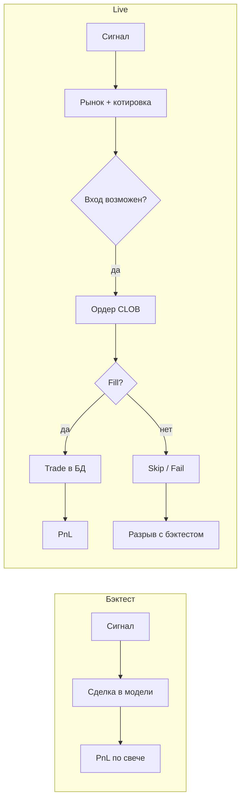

# Разрыв бэктест ↔ live: как было, почему болело, как стало

Этот документ — **отдельное, максимально подробное объяснение простым языком** для оператора и разработчика.  
Он отвечает на вопросы:

- как **раньше** реально работал вход в сделку в live;
- **почему** при сильном бэктесте live давал другой результат;
- **что изменили** в коде и настройках;
- **чего ждать** после выката (реалистично, без обещаний «как на графике»).

Техническая «шпаргалка по коду» по-прежнему в [ENTRY_MECHANISM.ru.md](./ENTRY_MECHANISM.ru.md).  
Цифры сверки за май 2026: [reports/backtest-vs-prod-dashboard-2026-05.ru.md](../reports/backtest-vs-prod-dashboard-2026-05.ru.md).

---

## Содержание

1. [Две разные «вселенные»: бэктест и live](#1-две-разные-вселенные-бэктест-и-live)
2. [Факты с твоего live (Trades.json, май 2026)](#2-факты-с-твоего-live-tradesjson-май-2026)
3. [Как раньше работал вход — шаг за шагом](#3-как-раньше-работал-вход--шаг-за-шагом)
4. [Пять главных причин разрыва с бэктестом](#4-пять-главных-причин-разрыва-с-бэктестом)
5. [Коммиты в период live: что менялось и ломало ли это вход](#5-коммиты-в-период-live-что-менялось-и-ломало-ли-это-вход)
6. [Как работает **сейчас** (после доработок)](#6-как-работает-сейчас-после-доработок)
7. [Насколько это улучшит ситуацию — честная оценка](#7-насколько-это-улучшит-ситуацию--честная-оценка)
8. [Что **не** исправит ни один патч](#8-что-не-исправит-ни-один-патч)
9. [Как проверять себя каждую неделю](#9-как-проверять-себя-каждую-неделю)
10. [Глоссарий](#10-глоссарий)

---

## 1. Две разные «вселенные»: бэктест и live

### Бэктест (то, что ты видишь на графике)

Упрощённо бэктест для blend_fade2 делает так:

1. Берёт исторические свечи BTC 5m.
2. На **закрытии** свечи решает: был ли **сигнал** на вход в **следующую** 5m свечу.
3. Если сигнал есть — **считает**, что вход **произошёл** (часто с фиксированной ценой, например **0.50**, или с правилом «вошли, если цена в коридоре»).
4. На **закрытии** целевой свечи считает win/loss по направлению BTC.

В отчёте `backtest-vs-prod-dashboard` сценарий **BT-A** — «идеал»: **все 451 сигнальный бар** → сделка, entry **0.50**, комиссия 0%, stake 1.5% compound.

Твой эксперимент «**срабатывают только 30% случайных сделок**» показывает: **стратегия по сигналу** может быть устойчивой даже при редких входах. Это про **качество сигнала**, не про Polymarket API.

### Live (то, что делает бот на VPS)

Live — это **другая цепочка**:

1. Тот же (или почти тот же) **сигнал** на закрытии свечи.
2. Нужно **найти рынок** Polymarket на эту 5m свечу.
3. Прочитать **живой bid/ask** (книга меняется каждую секунду).
4. Решить: **войти сейчас**, **подождать (patience)** или **пропустить**.
5. Отправить **post-only лимит** на CLOB, **дождаться fill** (или частичного fill).
6. Записать **Trade** или **SkippedBet** в SQLite.
7. Потом — settlement / redeem.

**Разрыв (execution gap)** — это всё, что между пунктом «сигнал есть» в бэктесте и фактом «сделка в БД с правильной ценой и размером» в live.



---

## 2. Факты с твоего live (Trades.json, май 2026)

Источники: экспорт **`Trades.json`** / **`SkippedBets.json`**, отчёт **`backtest-vs-prod-dashboard-2026-05.ru.md`**.  
Период live в JSON: **2026-05-26 13:30 UTC** → **2026-05-30** (примерно).

### Результат

| Метрика | Значение |
|---------|----------|
| Live-сделок | **311** |
| Суммарный PnL (по полю в JSON) | **≈ −$54.77** |
| Win rate | **≈ 45.7%** (142 win / 169 loss) |
| Сигнальных баров в сверке (бэктест) | **451** |
| Сделок в бэктесте BT-A на том же окне | **451** |
| PnL бэктеста BT-A | **≈ +$21** |

### PnL по дням (UTC)

| День | PnL | Комментарий |
|------|-----|-------------|
| 26 мая | **+$29.5** | Старт live, день в плюсе |
| 27 мая | **+$31.7** | Всё ещё в плюсе |
| 28 мая | **−$39.7** | Резкий перелом |
| 29 мая | **−$52.9** | Худший день; **18× `order_failed`** |
| 30 мая | **−$23.4** | Хвост периода |

**Важно:** 28–29 мая в git **не было новых коммитов** — на VPS крутилась та же ветка логики (~**v1.6.9 / v1.6.9.1**), что поставили 26–27 мая. Провал не совпадает с «вышел баговый релиз в день краха».

### Пропуски (SkippedBets, Live)

| Причина в БД | Сколько | Что видишь в UI |
|--------------|---------|-----------------|
| `no_signal` | 577 | **Skip** — сигнала не было, это норма |
| **`entry_price_out_of_range`** | **150** | **No entry** — сигнал был, цена не вошла в коридор за patience |
| **`order_failed`** | **21** | **Live order failed** — ордер не прошёл / не набрали fill |
| `engine_stopped` | 2 | Движок был остановлен |
| `no_market` | 1 | Не нашли рынок |

Для **разрыва с бэктестом** важны только строки **с сигналом**:

- **150 + 21 + 1 ≈ 172** «сигнал был — сделки нет» (execution-related);
- при этом **311 сделок уже состоялись** → доля входов по сигналу **~64%**, то есть **выше**, чем твои **30% random** в эксперименте.

**Вывод из цифр:** live проигрывал бэктест **не только из‑за «мало сделок»**. Было и другое: **какие** окна пропустили, **какие** вошли, и **исход** по вошедшим (WR ниже модели).

### Waterfall из отчёта (упрощённо)

| Компонент | USD | Смысл |
|-----------|-----|--------|
| BT-A (все сигналы @ 0.50) | +$21 | «Идеальная» модель |
| Execution gap (пропущенные бары) | −$136* | *Модельный* ущерб от невхода |
| Entry price edge (дешевле 0.50) | +$61 | Live иногда входил **лучше** 0.50 |
| Прочее (stake path…) | −$24 | Разница compound / факт |
| **= Production** | **−$31** | На сверенном окне Binance |

\*Counterfactual «если бы пропущенные бары торговались как BT-A» — **не обещание**, что в реальности они все были бы прибыльными; это **верхняя оценка** потерь от невхода.

---

## 3. Как раньше работал вход — шаг за шагом

Ниже — поведение **до пакета исправлений v1.7+** (типично то, что работало **26–29 мая 2026** на VPS).

### 3.1. Сигнал пришёл — что дальше?

1. **TradingEngineHostedService** получает `Entry` на открытие следующей 5m свечи.
2. Проверки: движок запущен, режим Live, есть **market** (YES/NO token), нет дубликата Trade/Skip на эту свечу.
3. Читается **bid** (для Limit) или **ask** (для Market) — котировка на момент решения.
4. **Ценовой gate:** цена в **(0 … 0.52]**?
   - **Да** → идём в **немедленный вход** (двухволновый maker или market).
   - **Нет** (например bid **0.55**) → запускается **patience** (фоновый **EntryPatienceExecutor**), до **60 с** (из `.env`).

### 3.2. Немедленный вход (Limit, основной режим)

Это **двухволновый post-only maker**:

| Волна | Стейк | Ожидание fill (по умолчанию) |
|-------|-------|------------------------------|
| **1** | Весь запрошенный | **45 с** |
| **2** | Только **остаток**, если волна 1 не добрала ~100% | **20 с** |

Перед каждой волной считается **лимитная цена** (ниже ask, с учётом tick size и минимум 5 shares) — см. [ENTRY_MECHANISM.ru.md](./ENTRY_MECHANISM.ru.md).

После ожидания:

- набрали **достаточно shares** → **Trade** в БД (`StakeUsd` = фактический fill);
- **мало shares** → **fail** → часто **`order_failed`** или skip, **без Trade**.

**Частичный fill поддерживался:** если волна 1 дала, например, 30%, а волна 2 не прошла — сделка могла записаться на **30%** (если shares ≥ минимума).

### 3.3. Patience (когда на открытии «дорого»)

1. На открытии bid **> 0.52** → patience.
2. В цикле ждём, пока bid опустится в коридор, и пробуем **одну maker-волну** (patience entry).
3. Если за **60 с** не заполнили в коридоре → **`entry_price_out_of_range`** → в UI **«No entry»**.

#### Критический баг логики (до v1.7): «patience 0.50 vs 0.52»

С **24 мая (v1.6.5)** до **30 мая (v1.7)** в коде было так:

| Тип входа | Максимальная цена |
|-----------|-------------------|
| Немедленный | **0.52** |
| Patience fill | **0.50** |

То есть бот мог **отказать** в patience-fill при bid **0.51**, хотя **немедленный** вход при 0.51 **разрешён**.  
Это **увеличивало No entry** без причины в бэктесте (если бэктест считал единый коридор **0.52**).

**Исправлено в v1.7:** `PatienceMaxEntryPrice = MaxEntryPrice` (**0.52**).

### 3.4. Post-only и «order crossed the book»

Polymarket для maker требует: лимит **не пересекает** текущий ask (иначе исполнение как taker или **отказ**).

**Раньше часто происходило:**

1. Bid/ask взяли **не самые свежие** (кэш, REST без обязательного refresh прямо перед `PlaceOrder`).
2. Лимит посчитали от **устаревшего** ask → CLOB отвечает **post-only cross** / «would cross the book».
3. Было **мало автоматических шагов вниз** по цене → попытка заканчивалась **`order_failed`**.
4. **29 мая** в данных **18 таких fail за один день** — типичная картина «книга убежала, бот не успел».

Бэктест **не симулирует** отказ CLOB на post-only.

### 3.5. Волна 2 и коридор 0.52

**Правильное поведение (после v1.6.6):**

- Перед волной 2 — **свежий** bid/ask.
- Если лимит волны 2 **> 0.52** → волна 2 **пропускается**.
- Если волна 1 **ничего** не набрала и волна 2 недоступна → **fail** (с v1.6.9 — явный текст «outside band»).

**Старый баг (до v1.6.6):** волна 2 могла исполниться по **0.77** при убежавшем рынке — **нарушение** стратегии; сделка в плюс, но **не как в модели**.

### 3.6. Что бэктест «не знает»

| В live | В бэктесте BT-A |
|--------|-----------------|
| Отказ CLOB / cross | Обычно нет |
| Ждать fill 45+20 с | Мгновенный вход |
| Patience 60 с | Часто другое правило цены |
| Минимум 5 shares | Упрощённо |
| `order_failed`, No entry | Либо вход, либо нет по цене |

---

## 4. Пять главных причин разрыва с бэктестом

### Причина 1 — Пропуски с сигналом (No entry + order_failed)

**150 No entry** — сигнал был, за окно patience **не вошли** в **(0 … 0.52]** (или в старой логике patience — **0.50**).

**21 order_failed** — сигнал был, но **ордер не довели** до нормального fill (cross, сеть, insufficient fill после волн).

Бэктест на этих барах **часто всё равно «входит»** → **+451** сделок vs **311** live.

**Это главный количественный разрыв**, даже при том что **64%** сигналов ты уже забирал (больше, чем 30% random).

### Причина 2 — Patience 0.50 vs 0.52 (до v1.7)

Дополнительные **No entry** на bid **0.51–0.52** в окне ожидания — **расхождение с идеей единого коридора**.

### Причина 3 — Устаревшая котировка и post-only cross

Не No entry в UI, а **`order_failed`** «под капотом» — особенно **29 мая**.

Бэктест не теряет эти бары; live терял.

### Причина 4 — Исход по **уже открытым** сделкам

WR live **~46.5%** vs бэктест **~51%** на тех же сигналах (BT-E).

Даже сценарий **BT-D** («все сигналы кроме price-skip, entry 0.50») на **311** сделках даёт **отрицательный** модельный PnL в отчёте — то есть **одни только «добрать пропуски»** не восстанавливают картину, если **качество исхода** на вошедших хуже.

Причины WR: рынок, сторона (Short хуже в отчёте), серия убытков, не settlement.

### Причина 5 — Разная «цена входа» в модели и в live

Бэктест BT-A: entry **0.50** фикс.  
Live: maker **0.45–0.51**, часто **дешевле** → **+entry price edge** (~**+$61** в waterfall).

То есть live **не всегда хуже** по цене — но **пропуски** и **WR** перевесили.

---

## 5. Коммиты в период live: что менялось и ломало ли это вход

Краткая хронология (автор — ты, ветка `mvp v1.x`):

| Когда (UTC ориентир) | Версия | Влияние на **вход** |
|----------------------|--------|---------------------|
| **26 мая ~12:28** | **v1.6.6** | Gate **0.52** на волнах 1–2, запрет лимита >0.52 при reprice — **меньше** «битых» входов, **больше** skip/fail на границе |
| 26 мая 14:25+ | v1.6.7 | Учёт PnL/stake snapshot — **не вход** |
| 26 мая ~16:08 | **v1.6.9** | Явный fail, если волна 2 blocked и волна 1 пустая; классификатор fail → skip reason |
| 27 мая | v1.6.9.1 | В основном **UI** |
| **28–29 мая** | — | **Коммитов нет** — код тот же; **−$92** за два дня |
| **30 мая ~07:02** | **v1.7** | Patience **0.52**, WS, fresh REST, cross-retries, `.env` tuning |
| 30 мая позже | v1.7.1–1.7.3 | Trade-лог, SignalR, SkipDetail, миграции |

**Вывод:** в дни худшей серии **механизм в git не «ломали свежим коммитом»** — работала **старая** связка (включая patience **0.50** и слабую обработку cross). Плюс **рынок/исполнение** (пик fail 29-го).

---

## 6. Как работает **сейчас** (после доработок)

Ниже — целевое состояние репозитория **после** пакета v1.7+ и последующих правок (trade-log, SignalR, SkipDetail, EF migration fix).

### 6.1. Сводная таблица «было → стало»

| Область | Раньше (типично 26–29 мая) | Сейчас |
|---------|---------------------------|--------|
| Patience max price | **0.50** | **0.52** (= немедленный вход) |
| Котировка перед ордером | Часто старая | **Обязательный свежий REST** перед `PlaceOrder`; WS если моложе **500 ms** |
| Post-only cross | Частый fail | До **5** шагов вниз + cap по ask (`POST_ONLY_*` в `.env`) |
| Fill wait | В основном REST poll | **User WebSocket** + poll **250 ms** |
| Старт после open 5m | Сразу | Задержка **300 ms** (`ENTRY_OPEN_DELAY_MS`) — меньше шума на open |
| Пропуски в БД | Только reason | **`SkipDetail`** (текст до 512 символов) |
| Логи | Всё в `polytrader-*.log` | Отдельно **`trade-execution-*.log`** (подробно) |
| UI / hub | `EntryFailed` мог не уходить | SignalR: **EntryFailed**, **PositionsFeedChanged** |
| Health / deploy | EF pending model crash | Migration **SyncPendingModel** + schema repair |

### 6.2. Поток входа сейчас (простыми словами)

1. **Сигнал** → (опционально) **300 ms** после открытия свечи.  
2. **Котировка:** WS, если свежая; иначе REST.  
3. **Gate 0.52:** если дорого → **patience до 60 с** с тем же потолком **0.52**.  
4. **Две волны maker:** перед **каждой** отправкой — **свежий** bid/ask; при cross — **сдвиг лимита вниз** (несколько попыток).  
5. **Fill:** user WS будит ожидание; иначе REST каждые **250 ms**.  
6. Успех → **Trade** + `EntryWavesJson`; неудача → **SkippedBet** + **`SkipDetail`** + строки в **`trade-execution-*.log`**.

### 6.3. Рекомендуемый `.env` (профиль исполнения)

```env
POLYTRADER_LIVE_MAKER_FILL_WAIT_SECONDS=45
POLYTRADER_LIVE_MAKER_REMAINDER_FILL_WAIT_SECONDS=20
POLYTRADER_ENTRY_MAX_WAIT_SECONDS=60
POLYTRADER_POST_ONLY_ASK_TICK_MARGIN=1
POLYTRADER_POST_ONLY_CROSS_TICK_RETRIES=5
POLYTRADER_ENTRY_OPEN_DELAY_MS=300
POLYTRADER_WS_QUOTE_MAX_AGE_MS=500
POLYTRADER_MAKER_FILL_POLL_MS=250
```

Если в trade-log часто **`MAKER_POST_ONLY_CROSS`** → попробуй **`POST_ONLY_ASK_TICK_MARGIN=2`**.

В UI: режим входа **Limit** (двухволновый maker).

### 6.4. Где читать следы

| Файл / место | Что там |
|--------------|---------|
| `logs/trade-execution-YYYYMMDD.log` | `ENTRY_*`, `PATIENCE_*`, `MAKER_*`, cross, волны |
| `logs/polytrader-YYYYMMDD.log` | Общий API (без trade-шума) |
| Таблица `SkippedBets` | `SkipReason` + **`SkipDetail`** |
| [ENTRY_MECHANISM.ru.md](./ENTRY_MECHANISM.ru.md) | Полный технический разбор |

Префиксы в trade-log:

- `ENTRY_SUCCESS` / `ENTRY_FAILED` / `ENTRY_GATE_OUTSIDE`
- `PATIENCE_START` / `PATIENCE_FILL` / `PATIENCE_SKIP`
- `MAKER_TWO_WAVE_START` / `MAKER_WAVE1_DONE` / `MAKER_POST_ONLY_CROSS`

---

## 7. Насколько это улучшит ситуацию — честная оценка

### Что должно улучшиться **заметно**

| KPI | Ожидание |
|-----|----------|
| **`order_failed`** | **Сильное снижение** (целевой ориентир: единицы в неделю, не 18/день) |
| **No entry**, когда bid был **0.51–0.52** в patience | **Снижение** после выравнивания patience **0.52** |
| **No entry**, когда цена была в коридоре, но cross/нет fill | **Часть** уйдёт в реальные сделки |
| **Понимание** пропусков | **100%** лучше (SkipDetail + trade-log) |
| **Операторский стресс** | UI быстрее показывает fail/skip |

### Что улучшится **умеренно**

| KPI | Ожидание |
|-----|----------|
| Общее число **No entry** | **Не в 2–3 раза меньше** — если bid **никогда** не ≤0.52 за 60 с, No entry **останется** (как в бэктесте с patience) |
| **Доля сигналов → сделок** | Может вырасти с **~64%** к **70–80%+** — **не** обязательно до **100%** (451/451) |
| **PnL** | Может **приблизиться** к бэктесту, если главный leak был execution; **гарантии нет** |

### Ориентиры «успеха» через 2–4 недели

Считай на VPS (SQL или экспорт):

```text
fill_rate = сделки / (сделки + entry_price_out_of_range + order_failed)
```

(только окна, где был сигнал на вход)

| fill_rate | Интерпретация |
|-----------|----------------|
| **≥ 70–75%** | Execution близок к «здоровому» для стратегии с random 30% |
| **order_failed / неделя < 5** | Cross/сеть под контролем |
| **PnL vs BT-A** | Смотреть после стабилизации fill_rate |

Сравни неделю **до** и **после** выката v1.7+ — не один день.

### Связь с твоим бэктестом «30% random»

Ты **уже** торговал **~64%** сигналов — **больше** 30%.  
Значит после фиксов цель — не «добиться 30%», а:

1. **Убрать «плохие» пропуски** (cross, patience 0.50, fail при цене в зоне).  
2. **Не ухудшить** отбор (не входить **хуже** random по исходам).  
3. Сверить **WR и PnL** с [backtest dashboard](../reports/backtest-vs-prod-dashboard-2026-05.ru.md) на **новом** окне.

---

## 8. Что **не** исправит ни один патч

1. **No entry**, если рынок **не дал** цену ≤0.52 — это **правило стратегии**, не баг.  
2. **`no_signal`** — нет входа, потому что **нет сигнала** (577 в JSON).  
3. **Серии убытков** при WR **< 50%** на вошедших — нужен разбор **сигнала / режима рынка**, не только CLOB.  
4. **Полное совпадение** с BT-A (+$21 на 451 сделке) — live останется live.  
5. **Расширение коридора до 0.53** само по себе — **мало** новых входов (узкий диапазон); см. обсуждение в чате; бэктест и live нужно **синхронно** менять.

---

## 9. Как проверять себя каждую неделю

### Чеклист воскресенья (15 минут)

1. **Сделок за неделю** / **сигнальных окон** → `fill_rate`.  
2. **`order_failed`** — сколько; открыть 2–3 `SkipDetail` / trade-log.  
3. **`entry_price_out_of_range`** — сколько; если много — это рынок или patience?  
4. **PnL** vs предыдущая неделя (не vs бэктест в одиночку).  
5. Прогнать (при необходимости) `scripts/backtest_vs_prod_dashboard.py` на свежем экспорте.

### Пример SQL (SQLite на VPS)

```sql
-- Пропуски с сигналом за 7 дней
SELECT "SkipReason", COUNT(*) 
FROM "SkippedBets"
WHERE "Mode" = 'Live'
  AND "SkipReason" NOT IN ('no_signal', 'engine_stopped', 'waiting_for_entry')
  AND "CreatedAt" >= datetime('now', '-7 days')
GROUP BY 1;

-- Сделки за 7 дней
SELECT COUNT(*), SUM("PnlUsd"), 
       SUM(CASE WHEN "Won" = 1 THEN 1 ELSE 0 END) AS wins
FROM "Trades"
WHERE "Mode" = 'Live'
  AND "CreatedAt" >= datetime('now', '-7 days');
```

### Красные флаги в `trade-execution-*.log`

- Много **`MAKER_POST_ONLY_CROSS`** подряд → margin **2** или спокойнее open delay.  
- **`ENTRY_FAILED`** с одним и тем же текстом → сеть / ключ / funder.  
- **`PATIENCE_SKIP`** на каждом сигнале → рынок системно дорогой (не обязательно баг).

---

## 10. Глоссарий

| Термин | Значение |
|--------|----------|
| **Сигнальный бар** | 5m свеча, на которую стратегия выдала Entry |
| **No entry** | UI-ярлык для `entry_price_out_of_range` |
| **Patience** | Ожидание снижения цены после дорогого open |
| **Post-only** | Лимит только maker; не пересекать ask |
| **Cross** | Отказ: лимит «пересёк» книгу |
| **Wave 1 / 2** | Первая попытка на полный стейк; вторая — на остаток |
| **Execution gap** | Разница «сигнал в бэктесте» vs «факт в live» |
| **BT-A** | Бэктест: все сигналы, entry 0.50 |
| **fill_rate** | Доля сигнальных окон, где есть Trade |

---

## Связанные документы

| Документ | Зачем |
|----------|--------|
| [ENTRY_MECHANISM.ru.md](./ENTRY_MECHANISM.ru.md) | Точный алгоритм входа по коду |
| [deploy/OPERATIONS.ru.md](../deploy/OPERATIONS.ru.md) | Деплой, логи, перезапуск API |
| [reports/backtest-vs-prod-dashboard-2026-05.ru.md](../reports/backtest-vs-prod-dashboard-2026-05.ru.md) | Цифры май 2026 |
| [blend_fade2/STRATEGY.md](./blend_fade2/STRATEGY.md) | Логика сигнала |

---

*Документ создан для операторской ясности после анализа `Trades.json`, `SkippedBets.json`, git-истории 24–30 мая 2026 и кода v1.7+. При изменении механизма входа обновляйте этот файл вместе с [ENTRY_MECHANISM.ru.md](./ENTRY_MECHANISM.ru.md).*
