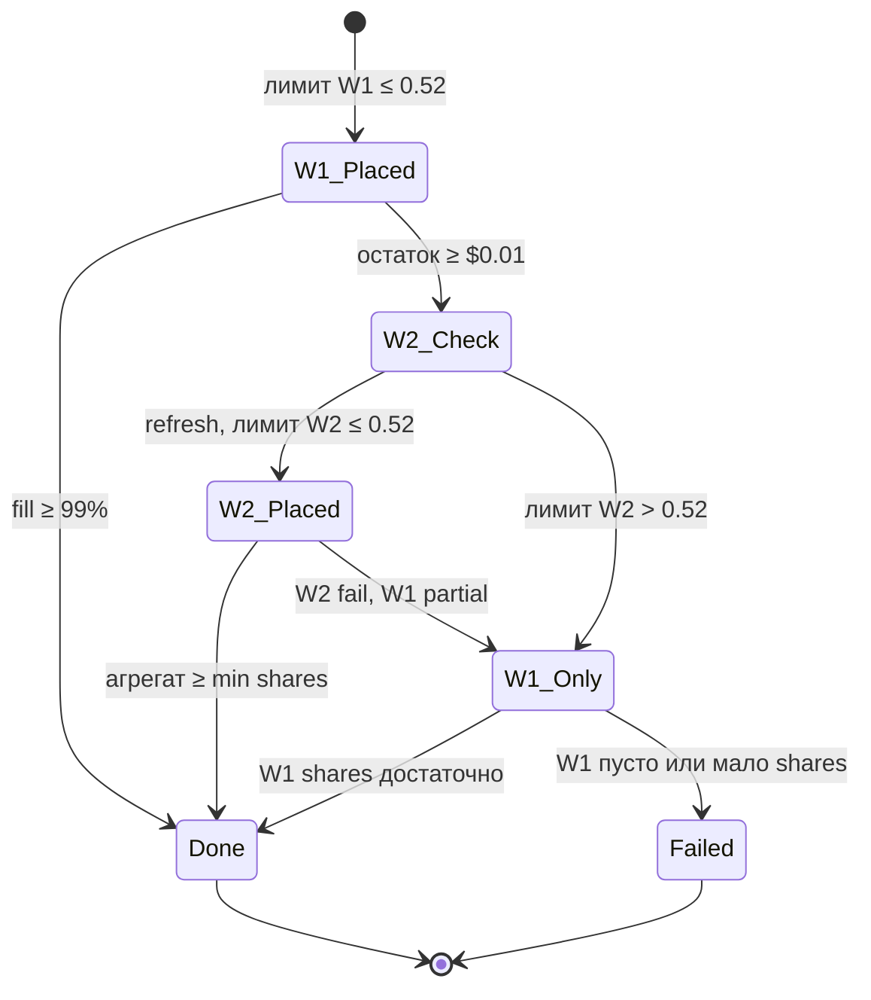

# Механизм входа в сделку (Live / Paper)

Подробное описание того, как бот решает войти в позицию на Polymarket после сигнала стратегии: ценовые коридоры, режимы ордеров, двухволновый maker-limit, окно patience и запись в БД.

Связанные материалы:

- Стратегия сигналов: [blend_fade2/STRATEGY.md](./blend_fade2/STRATEGY.md)
- Эксплуатация на VPS: [deploy/OPERATIONS.ru.md](../deploy/OPERATIONS.ru.md)

Ключевые файлы в коде:

| Область | Файл |
|--------|------|
| Ценовые правила | `src/PolyTrader.Core/Strategy/EntryPriceRules.cs` |
| Min 5 shares, bump стейка | `src/PolyTrader.Core/Strategy/LimitEntryRules.cs` |
| Режимы ордеров | `src/PolyTrader.Core/Models/LiveEntryOrderModes.cs` |
| Решение «входить сейчас / patience» | `src/PolyTrader.Infrastructure/Services/TradingEngineHostedService.cs` |
| Patience (фон) | `src/PolyTrader.Infrastructure/Services/EntryPatienceExecutor.cs` |
| Обёртка CLOB | `src/PolyTrader.Infrastructure/Polymarket/PolymarketClobService.cs` |
| Две волны maker | `src/PolyTrader.Infrastructure/Polymarket/PolymarketRestTradingClient.cs` |
| Расчёт post-only лимита | `src/PolyTrader.Infrastructure/Polymarket/MakerLimitPricing.cs` |
| JSON волн в `Trades` | `src/PolyTrader.Infrastructure/Polymarket/TradeEntryWavesJson.cs` |

---

## Содержание

1. [Краткая схема](#краткая-схема)
2. [Ценовые коридоры](#ценовые-коридоры)
3. [Режимы входа (`LiveEntryOrderMode`)](#режимы-входа-liveentryordermode)
4. [От сигнала до ордера](#от-сигнала-до-ордера)
5. [Немедленный вход (цена уже в коридоре)](#немедленный-вход-цена-уже-в-коридоре)
6. [Patience-вход (цена на открытии выше коридора)](#patience-вход-цена-на-открытии-выше-коридора)
7. [Двухволновый maker-limit (основной Live Limit)](#двухволновый-maker-limit-основной-live-limit)
8. [Как считается цена лимита (post-only)](#как-считается-цена-лимита-post-only)
9. [Волна 2: когда срабатывает и когда нет](#волна-2-когда-срабатывает-и-когда-нет)
10. [Минимальный размер ордера Polymarket](#минимальный-размер-ордера-polymarket)
11. [Запись сделки и `EntryWavesJson`](#запись-сделки-и-entrywavesjson)
12. [Причины пропуска (`SkippedBets`)](#причины-пропуска-skippedbets)
13. [Настройки и переменные окружения](#настройки-и-переменные-окружения)
14. [Логи: что искать](#логи-что-искать)
15. [Примеры сценариев](#примеры-сценариев)
16. [История: баг входа по 0.77 на волне 2](#история-баг-входа-по-077-на-волне-2)

---

## Краткая схема

```mermaid
flowchart TD
    A[Сигнал Entry на 5m свече] --> B{Уже есть Trade/Skip?}
    B -->|да| Z[Выход]
    B -->|нет| C[Рынок Polymarket + bid/ask]
    C --> D{bid/ask в 0, 0.52]?}
    D -->|нет| E[Patience до 30 с, коридор 0, 0.50]
    E --> F{Fill?}
    F -->|да| T[Запись Trade]
    F -->|нет| S[Skip entry_price_out_of_range]
    D -->|да| G[Баланс, стейк, режим ордера]
    G --> H{Limit maker?}
    H -->|Market| M[Рыночная покупка]
    H -->|Limit| W1[Волна 1: post-only, ждём ~45 с]
    W1 --> I{Полный fill?}
    I -->|да| T
    I -->|нет| R[Свежий bid/ask с API]
    R --> J{Лимит волны 2 ≤ 0.52?}
    J -->|нет| K[Пропуск волны 2]
    J -->|да| W2[Волна 2: остаток, ~20 с]
    W2 --> L{Достаточно shares?}
    K --> L
    L -->|да| T
    L -->|нет| SF[Fail / skip / partial]
    M --> T
```

---

## Ценовые коридоры

Все новые **лимитные** входы ограничены константами в `EntryPriceRules`:

| Правило | Константа | Диапазон | Где применяется |
|--------|-----------|----------|-----------------|
| Основной коридор | `MaxEntryPrice = 0.52` | `(0, 0.52]` | Немедленный вход; волна 1 и волна 2 maker; перекотировка после post-only cross |
| Patience | `PatienceMaxEntryPrice = 0.50` | `(0, 0.50]` | Окно ожидания после дорогой котировки на открытии |
| Длительность patience | `PatienceWaitDuration` | 30 с | `EntryPatienceExecutor` |

Проверки:

- `EntryPriceRules.IsAllowed(price)` — основной коридор.
- `EntryPriceRules.IsPatienceFillAllowed(price)` — patience.

**Важно:** для режима **Market** на первом шаге в gate используется **ask**, а не bid. Maker-режимы используют **best bid**.

Patience **уже**, чем основной вход: если на открытии bid = 0.51, немедленный вход возможен (≤ 0.52), patience не запускается. Patience включается только когда котировка **строго выше 0.52** (например 0.55 на открытии).

---

## Режимы входа (`LiveEntryOrderMode`)

Настройка в UI / `EngineSettings.LiveEntryOrderMode`. Нормализация: `LiveEntryOrderModes.Normalize`.

| Режим | Значение в БД | Поведение Live |
|-------|---------------|----------------|
| **Limit** | `Limit`, `Maker` (legacy) | Двухволновый **post-only maker** (см. ниже). Стейк может быть **увеличен (bump)** до минимума 5 shares. |
| **Market** | `Market` | Покупка по рынку (`PlaceMarketBuyUsdAsync`), ценовой gate по **ask**. |
| **LimitElseMarket** | `LimitElseMarket`, `Limit-Market` | Если стейк ≥ min для 5 shares @ bid — limit; иначе в текущей конфигурации часто **skip** (`clob_min_order_size`), без автоматического market fallback в limit-only ветке движка. |

Paper: для limit-режимов симуляция использует bid; patience опрашивает bid каждые 2 с.

---

## От сигнала до ордера

### 1. Сигнал стратегии

Движок (`TradingEngineHostedService`) получает `actions.Entry`:

- `TargetCandleTime` — unix-время **открытия** целевой 5m свечи (секунды).
- `Trend` — `Long` → сторона **Up** (YES), `Short` → **Down** (NO).

### 2. Идемпотентность

Перед входом проверяется таблица `Trades` (и при patience — также `SkippedBets`) для пары `(CandleTime, Mode, PaperAccountId)`. Повторный вход на ту же свечу не делается.

На live также используется **claim** на `TargetCandleTime`, чтобы два параллельных цикла движка не выставили два ордера.

### 3. Рынок и токен

`ResolveMarketForCandleAsync` находит BTC 5m рынок Polymarket. Токен исхода:

- Long → `YesTokenId`
- Short → `NoTokenId`

### 4. Котировки

| Режим | Цена для gate | Цена для ордера |
|-------|---------------|-----------------|
| Limit / LimitElseMarket | **bid** | bid (+ ask для расчёта post-only cap) |
| Market | **ask** | ask |

Источники: CLOB REST / WebSocket (`ResolveMakerBidPriceAsync`, `ResolveAskPriceAsync`).

### 5. Ветвление по цене

```
if quoteForPriceGate NOT in (0, 0.52]:
    → EntryPatienceExecutor.Start()   // фон, до 30 с
else:
    → немедленный расчёт стейка и PlaceEntryOrderAsync
```

---

## Немедленный вход (цена уже в коридоре)

Последовательность в `TradingEngineHostedService` (ветка `else` после `EntryPriceRules.IsAllowed`).

### Шаг A — баланс

- **Paper:** баланс paper-счёта.
- **Live:** `GetCollateralBalanceAsync`. При `null` → skip `balance_unavailable`.

### Шаг B — стейк

`BetStakeResolver` + настройки (`BetStakeMode` Fixed/Percent, caps).

Для **Limit**:

- `LimitEntryRules.Plan` — при необходимости **bump** стейка до минимума 5 shares @ текущий bid.
- Если `CanTrade == false` → skip `clob_min_order_size`.

Для **LimitElseMarket** — `HybridEntryRules.PlanLimitElseMarket`.

Минимальный live-стейк: `SafeBetStake.MinBetStake` (проверка после расчёта).

### Шаг C — отправка в CLOB

`PolymarketClobService.PlaceEntryOrderAsync(tokenId, stake, effectiveOrderMode, bid, ask, entryKey)`:

- **Market** → один рыночный ордер.
- **Limit** → `PlaceMakerLimitBuyUsdAsync` → **две волны** (см. раздел ниже).

`LiveEntryOrderKey` привязывает client order id к `(CandleTime, tokenId)` для идемпотентности и recovery после сетевых сбоев.

### Шаг D — результат

| Исход | Действие |
|-------|----------|
| Success, fill ≥ min shares | `Trades` + `EntryWavesJson` при maker |
| Fail | skip `order_failed` + текст `FailureReason` |
| Partial (редко при market) | записывается фактический `FilledStakeUsd` |

---

## Patience-вход (цена на открытии выше коридора)

Запускается, когда **первый** bid (или ask для market-ветки gate) **> 0.52**.

Файл: `EntryPatienceExecutor.cs` — фоновая задача `Task.Run`, один запуск на ключ `Mode:AccountId:CandleTime`.

### Алгоритм patience

1. Проверка: движок ещё `IsRunning`, нет дубликата trade/skip.
2. Баланс и стейк (с учётом режима, для sizing в patience используется `PatienceMaxEntryPrice` как опорный bid).
3. **Live:** `PlacePatienceEntryOrderAsync` → **одна волна** maker:
   - bid-hint = **0.50** (`PatienceMaxEntryPrice`);
   - ожидание fill = **30 с** (`PatienceWaitDuration`);
   - **не** используется двухволновая схема.
4. После fill проверка: итоговая цена входа в `(0, 0.50]`; иначе fill отбрасывается.
5. **Paper:** poll bid каждые 2 с; при bid ≤ 0.50 — мгновенный «fill» по `min(bid, 0.50)`.
6. Таймаут 30 с без fill → skip `entry_price_out_of_range`.

UI/лента: состояние ожидания через `IEntryWaitTracker` (`EntryWaitState`).

Patience и двухволновый Limit **не комбинируются** в одном входе.

---

## Двухволновый maker-limit (основной Live Limit)

Реализация: `PolymarketRestTradingClient.PlaceMakerLimitBuyTwoWavesAsync`.

Цель: выставить **post-only** лимитную покупку (maker), подождать исполнение; если не набрали полный стейк — **вторая попытка на остаток** с **обновлённой** котировкой, но **в том же ценовом коридоре (0, 0.52]**.

### Тайминги ожидания fill

| Волна | Env / опция | По умолчанию |
|-------|-------------|--------------|
| 1 | `POLYTRADER_LIVE_MAKER_FILL_WAIT_SECONDS` → `LiveMakerFillWaitSeconds` | **45 с** |
| 2 | `POLYTRADER_LIVE_MAKER_REMAINDER_FILL_WAIT_SECONDS` → `LiveMakerRemainderFillWaitSeconds` | **20 с** |

Внутри волны: после `PlaceOrderAsync` вызывается `WaitForMakerFillAsync` до истечения таймаута.

### Волна 1 — «Attempt 1»

1. **Котировка:** bid/ask из hint'ов на момент решения движка (`refreshFromApi: false`).
2. **Лимит:** `MakerLimitPricing.ComputePostOnlyBuyLimit` (см. раздел ниже).
3. **Gate:** если лимит `> 0.52` → **весь вход отменяется** (fail до CLOB).
4. **Ордер:** post-only GTC buy на **полный** `requestedStakeUsd`.
5. **Ожидание:** до 45 с.
6. **Post-only cross:** до 2 шагов «на тик ниже»; один раз перекотировка с API, но **не выше 0.52**.

### Условие перехода к волне 2

```
filledStake >= requestedStake - $0.01  →  SUCCESS, волна 2 не нужна
remainder < $0.01                      →  SUCCESS (остаток копеечный)
иначе                                  →  волна 2 на remainder
```

`remainder = requestedStake - filledStake` (по USD fill волны 1).

### Волна 2 — «Attempt 2 (remainder)»

1. **Котировка:** `refreshFromApi: true` — свежие bid/ask с CLOB.
2. **Лимит** на **только остаток** `remainderStake`.
3. **Gate:** если лимит `null` или `> 0.52` → **волна 2 пропускается** (warning в лог), возврат агрегата только с волной 1.
4. **Ордер:** post-only на остаток, ожидание до 20 с.
5. При fail placement волны 2 — **сохраняется** fill волны 1 (если был).

### Агрегация и минимальный fill

`BuildAggregatedMakerOutcome`:

- Суммируются shares и USD по волнам.
- Средняя цена: взвешенная по shares.
- Если `totalMatchedShares < 0.01` → **fail** («Insufficient maker fill after 2 waves») → сделка **не** создаётся.

Частичный вход возможен, если волна 1 дала достаточно shares, а волна 2 пропущена или не добрала.

### Client Order ID

- Волна 1: `entryKey.DeriveClientOrderId(0)`
- Волна 2: `entryKey.DeriveClientOrderId(1)`

Разные salt → разные ордера на CLOB, без duplicate на остаток.

---

## Как считается цена лимита (post-only)

`MakerLimitPricing.ComputePostOnlyBuyLimit(bid, ask, tickSize, stakeUsd)`:

1. `bid` округляется **вниз** до tick size.
2. Если есть ask: лимит не выше `ask - 1 tick` (строго post-only, не пересечь ask).
3. **Cap по стейку:** цена не выше `stakeUsd / 5` (чтобы 5 shares уложились в стейк).
4. Итог должен давать ≥ **5 shares** и stake ≥ `5 × price`.

Итог: это **наивысший** допустимый post-only bid в рамках стакана и размера ставки, не «рыночная» цена.

Проверка **0.52** применяется **после** этого расчёта (отдельно от математики post-only).

---

## Волна 2: когда срабатывает и когда нет

| # | Условие | Волна 2 |
|---|---------|---------|
| 1 | Волна 1 заполнила ≥ ~99% стейка | **Нет** |
| 2 | Остаток < $0.01 | **Нет** |
| 3 | Остаток ≥ $0.01, свежий лимит **≤ 0.52** | **Да** |
| 4 | Остаток ≥ $0.01, лимит **> 0.52** или не выводится | **Нет** (skip) |
| 5 | Волна 1 = 0 fill, волна 2 skip | Итог: **нет сделки** (insufficient fill) |
| 6 | Волна 1 partial, волна 2 skip | **Partial trade** (если shares достаточно) |

### Типичные «хорошие» случаи волны 2

- Волна 1 @ 0.45 набрала 30% → bid всё ещё 0.48 → волна 2 добирает 70% @ ~0.48.
- Волна 1 @ 0.50, 0 fill, bid опустился до 0.49 → волна 2 на весь стейк @ ~0.49.

### Случай «цена убежала» (исправленный баг)

- Волна 1 @ 0.45, 0 fill за 45 с.
- За это время исход подорожал до bid 0.77.
- **До фикса:** волна 2 ставила лимит ~0.77 и исполнялась.
- **После фикса:** лимит 0.77 > 0.52 → волна 2 **пропускается** → входа нет.

Это **намеренное** поведение: лучше пропустить свечу, чем купить дороже коридора стратегии.

---

## Минимальный размер ордера Polymarket

`LimitEntryRules.MinOrderShares = 5`.

Минимальный стейк в USD: `ceil(5 × limitPrice × 100) / 100`.

Примеры @ limit:

| Limit | Min stake ≈ |
|-------|-------------|
| 0.45 | $2.25 |
| 0.50 | $2.50 |
| 0.52 | $2.60 |

Режим **Limit** может увеличить запрошенный стейк (bump) до этого минимума, если баланс позволяет.

---

## Запись сделки и `EntryWavesJson`

Таблица `Trades` (поля, важные для входа):

| Поле | Смысл |
|------|--------|
| `CandleTime` | Целевая свеча входа |
| `StakeUsd` | Фактически исполненный USD |
| `RequestedStakeUsd` | Запрошенный стейк |
| `EntryPrice` | Средняя цена входа (по fill) |
| `PolymarketOrderId` | ID **первой** волны с order id (может не совпадать с волной, где был основной fill) |
| `EntryWavesJson` | JSON массив волн |

Формат волны (`TradeEntryWaveDto`):

```json
{
  "wave": 1,
  "label": "Attempt 1",
  "requestedUsd": 3.85,
  "filledUsd": 0,
  "fillPercent": 0,
  "entryPrice": 0.45,
  "orderId": "0x..."
}
```

```json
{
  "wave": 2,
  "label": "Attempt 2 (remainder)",
  "requestedUsd": 3.85,
  "filledUsd": 3.84,
  "fillPercent": 99.8,
  "entryPrice": 0.48,
  "orderId": "0x..."
}
```

Сериализация: `TradeEntryWavesJson.Serialize`.

---

## Причины пропуска (`SkippedBets`)

| `SkipReason` | Когда |
|--------------|--------|
| `no_market` | Нет рынка на свечу |
| `balance_unavailable` | Не прочитали USDC с CLOB |
| `insufficient_balance` | Баланс / стейк ниже минимума |
| `clob_min_order_size` | Стейк не тянет 5 shares @ bid |
| `entry_price_out_of_range` | Patience 30 с без fill в (0, 0.50] |
| `order_failed` | CLOB вернул ошибку на немедленном входе |

Частичные maker-fill без достаточных shares обычно дают `order_failed` с текстом про insufficient fill, без записи `Trades`.

---

## Настройки и переменные окружения

| Параметр | Где | Описание |
|----------|-----|----------|
| `LiveEntryOrderMode` | Engine settings / API | `Limit`, `Market`, `LimitElseMarket` |
| `POLYTRADER_LIVE_MAKER_FILL_WAIT_SECONDS` | `.env` | Таймаут волны 1 (≥ 1) |
| `POLYTRADER_LIVE_MAKER_REMAINDER_FILL_WAIT_SECONDS` | `.env` | Таймаут волны 2 (≥ 1) |
| `POLYMARKET_PRIVATE_KEY` | `.env` | Без ключа live-ордера не отправляются |

После смены env на VPS: пересоздать контейнер **api** (см. `deploy/OPERATIONS.ru.md`).

---

## Логи: что искать

| Сообщение | Значение |
|-----------|----------|
| `entry quote ... outside (0, 0.52]` | Старт patience |
| `Placing live maker two-wave buy` | Начало двухволнового входа |
| `Maker entry wave 1 for` | Волна 1 выставлена |
| `Maker wave 1 unfilled ... re-quoting wave 2` | Переход к волне 2 |
| `Skipping maker wave 2 ... outside allowed entry band` | Волна 2 заблокирована по 0.52 |
| `Maker entry wave 2 for` | Волна 2 выставлена |
| `Insufficient maker fill after 2 waves` | Нет сделки |
| `Patience live entry not filled` | Patience без входа |
| `Refusing maker limit re-price ... above entry cap` | Перекотировка не подняла цену выше 0.52 |

---

## Примеры сценариев

### A — Идеальный одноволновый вход

- Bid 0.47, стейк $4.
- Волна 1 @ 0.47, fill 100% за 10 с.
- Волна 2 не запускается.
- `EntryWavesJson`: одна волна, `fillPercent: 100`.

### B — Двухволновый в коридоре

- Запрос $4, волна 1 @ 0.46 → $1.5 (37%).
- Refresh bid 0.48, лимит волны 2 ≤ 0.52.
- Волна 2 добирает $2.5 @ ~0.48.
- Trade: `StakeUsd ≈ 4`, средняя цена между 0.46 и 0.48.

### C — Цена убежала (после фикса)

- Волна 1 @ 0.45, $0 fill.
- Refresh bid 0.77 → skip волны 2.
- Fail insufficient fill → **нет Trade**.

### D — Patience

- На открытии bid 0.55 → patience 30 с.
- Через 12 с bid 0.49 → одиночный maker @ ≤ 0.50, fill.
- Trade с ценой ≤ 0.50.

### E — Дорого с самого начала, patience не помог

- Bid 0.60 на открытии → patience.
- 30 с bid не опускался ≤ 0.50 → skip `entry_price_out_of_range`.

---

## История: баг входа по 0.77 на волне 2

**Симптом (prod):** волна 1 лимит 0.45, fill 0%; волна 2 fill ~$3.84 @ **0.77**; сделка выиграла, но нарушила правило стратегии (0.00–0.52).

**Причина:** `EntryPriceRules` проверялся только в движке на **начальной** котировке. Волна 2 брала **свежий** стакан без повторной проверки коридора.

**Исправление** (`PolymarketRestTradingClient`):

- Gate ≤ 0.52 перед волной 1, перед волной 2, в single-wave maker.
- Gate в `ExecuteMakerLimitWaveAsync` перед отправкой ордера.
- Отказ поднимать лимит выше 0.52 при перекотировке после post-only cross.

---

## Диаграмма состояний двух волн



---

*Документ отражает код в репозитории poly-trader. При изменении `EntryPriceRules`, таймингов или числа волн обновляйте этот файл вместе с PR.*
