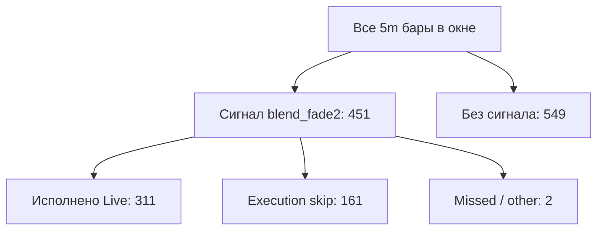

# Dashboard: Backtest vs Production (blend_fade2)

**Дата отчёта:** 2026-05-30 05:44 UTC  
**Стратегия:** blend_fade2 (`PresetPnlMax`: lookback=48, fast=18, z=1.08, z_fast_min=0.6)  
**Инструмент:** BTCUSDT 5m (Binance Vision)

---

## 1. Резюме

| KPI | Production (Live, Binance cov.) | Backtest BT-A (ideal) |
|-----|--------------------------------|------------------------|
| Сделок | 288 (311 всего) | 451 |
| Win rate | 46.5% | 51.0% |
| Total PnL | $-31.37 ($-54.77 всего) | +$21.26 |
| ROI на старт. баланс | -13.0% | 8.8% |
| Profit factor | 0.92 | — |
| Max loss streak | 7 | — |

**Главный вывод:** за период **2026-05-26 — 2026-05-29** (сверка по Binance) production зафиксировал **$-31.37** на **288** сделках, тогда как идеальный бэктест BT-A дал бы **+$21.26** на **451** сделках. Разрыв **$-52.64**. Полный Live PnL за окно до 2026-05-30: **$-54.77** (311 сделок).

- Сигнальных баров в окне: **451**; исполнено: **311** (69.0% coverage)
- Execution skips (`entry_price_out_of_range` и др.): **161**
- Сделок без сигнала (аномалии): **0**
- Side mismatch: **0**

---

## 2. Источники и период

| Источник | Путь | Записей |
|----------|------|---------|
| Live trades | `Trades.json` | 311 |
| Skipped bets | `SkippedBets.json` | 751 (Live, deduped) |
| Binance 5m | archived `btcusdt_5m_2026.json` | 1073 баров в срезе (+72 warmup) |

**Окно анализа (UTC):** 2026-05-26 12:35 UTC → 2026-05-30 05:30 UTC  
**Окно бэктеста (Binance OHLC):** 2026-05-26 12:35 UTC → 2026-05-29 23:55 UTC (архив до 2026-05-29 23:55 UTC)  
**Сделок вне покрытия Binance:** 23 (PnL $-23.40) — исключены из сверки Won/сигналов  
**Стартовый баланс (оценка):** $241.83 — обратный расчёт от сделки #292: $241.83  
**Stake:** 1.5% compound, cap $500  
**Live fee:** 0% (maker); BT-B использует 1.8%

- Python vs C# сигналы в окне: **совпадают** (Python=451, C#=451)


---

## 3. Фактический результат (Live)

| Метрика | Значение |
|---------|----------|
| Сумма StakeUsd | $1,266.36 |
| Сумма PnlUsd (всего) | $-54.77 |
| Сумма PnlUsd (Binance cov.) | $-31.37 |
| ROI на deployed stake | -4.3% |
| Wins / Losses | 142 / 169 |
| Long WR | 80/172 (46.5%) |
| Short WR | 62/139 (44.6%) |
| Wins без RedeemedAt | 0 (0.0% побед) |

### PnL по дням (UTC)

| Дата | PnL |
| --- | --- |
| 2026-05-26 | +$29.51 |
| 2026-05-27 | +$31.70 |
| 2026-05-28 | $-39.67 |
| 2026-05-29 | $-52.90 |
| 2026-05-30 | $-23.40 |

### Long vs Short

| Сторона | Сделок | Wins | WR | PnL |
| --- | --- | --- | --- | --- |
| Long (Up) | 172 | 80 | 46.5% | $-18.13 |
| Short (Down) | 139 | 62 | 44.6% | $-36.64 |

---

## 4. Бэктест: сценарии BT-A … BT-E

| ID | Сделок | Wins | WR | PnL | End balance | Max DD |
|----|--------|------|----|-----|-------------|--------|
| PROD | 288 | 134 | 46.5% | $-31.37 | +$210.45 | n/a |
| BT-A | 451 | 230 | 51.0% | +$21.26 | +$263.09 | 72.99 |
| BT-B | 451 | 230 | 51.0% | $-8.90 | +$232.92 | 79.82 |
| BT-C | 288 | 134 | 46.5% | $-32.45 | +$209.37 | 112.15 |
| BT-D | 311 | 142 | 45.7% | $-86.09 | +$155.74 | 112.54 |
| BT-E | 451 | 230 | 51.0% | +$0.00 | +$0.00 | 0.0 |

**Описание сценариев:**
- **BT-A** — все сигналы, entry=0.50, fee=0%, compound 1.5%
- **BT-B** — как BT-A, fee=1.8% (paper/doc модель)
- **BT-C** — только prod-сделки, фактические stake и entry price
- **BT-D** — все сигналы кроме `entry_price_out_of_range`, entry=0.50
- **BT-E** — signal-only win rate (без PnL compound)

BT-E win rate: **51.0%** (230/451)

---

## 5. Сравнение prod vs backtest (waterfall PnL)

| Компонент | USD | Пояснение |
|-----------|-----|-----------|
| BT-A (ideal) | +$21.26 | Все сигналы, entry 0.50 |
| − Execution gap | $-136.27 | Пропущено 161 signal-баров (price/order/balance) |
| + Entry price edge | +$61.22 | Выигрыши по цене < 0.50 vs модель 0.50 |
| ± Stake path / прочее | $-24.20 | Фактические stake vs compound на тех же барах |
| **= Production** | **$-31.37** | Факт |

На совпадающих сделках BT-A (только traded bars): PnL = **$-68.39** vs prod **$-31.37**.

---

## 6. Покрытие сигналов



### Skip reasons (Live, deduped)

| SkipReason | Count |
| --- | --- |
| no_signal | 577 |
| entry_price_out_of_range | 150 |
| order_failed | 21 |
| engine_stopped | 2 |
| no_market | 1 |

### Классификация баров

| Classification | Count |
| --- | --- |
| no_signal | 549 |
| aligned | 288 |
| execution_skip | 161 |
| missed_signal | 2 |
| other_skip | 1 |

Counterfactual PnL на execution-skipped signal барах (BT-A модель): **+$136.27** (161 bets, WR 59.6%)

---

## 7. Сделка-к-сделке (выборка)

Полная таблица: [`reports/data/trade_reconciliation.csv`](data/trade_reconciliation.csv) (311 строк)

| UTC | Side | Stake | Entry | PnL | Won | Signal | Edge@0.5 |
| --- | --- | --- | --- | --- | --- | --- | --- |
| 05-26 13:30 | Up | $3.68 | 0.5 | $-3.68 | 0 | yes | 0.0 |
| 05-26 13:35 | Up | $3.63 | 0.49 | +$3.77 | 1 | yes | 0.148 |
| 05-26 13:50 | Down | $3.69 | 0.34 | +$7.15 | 1 | yes | 3.4688 |
| 05-26 14:20 | Down | $3.79 | 0.5 | $-3.79 | 0 | yes | 0.0 |
| 05-26 14:25 | Down | $3.73 | 0.49 | $-3.73 | 0 | yes | 0.0 |
| 05-26 14:30 | Down | $3.68 | 0.5 | +$3.68 | 1 | yes | 0.0 |
| 05-26 14:35 | Down | $3.62 | 0.45 | +$4.43 | 1 | yes | 0.805 |
| 05-26 14:40 | Up | $3.68 | 0.48 | $-3.68 | 0 | yes | 0.0 |
| 05-26 14:45 | Up | $3.75 | 0.5 | +$3.75 | 1 | yes | 0.0 |
| 05-26 15:10 | Up | $3.75 | 0.47 | +$4.22 | 1 | yes | 0.4782 |
| 05-26 15:20 | Up | $3.92 | 0.5 | $-3.92 | 0 | yes | 0.0 |
| 05-26 15:25 | Up | $3.86 | 0.5 | $-3.86 | 0 | yes | 0.0 |
| 05-26 15:30 | Up | $3.81 | 0.5 | $-3.81 | 0 | yes | 0.0 |
| 05-26 15:40 | Up | $3.75 | 0.5 | +$3.75 | 1 | yes | 0.0 |
| 05-26 15:45 | Up | $3.69 | 0.37 | $-3.69 | 0 | yes | 0.0 |
| 05-30 04:25 | Up | $3.20 | 0.46 | $-3.20 | 0 | no | — |
| 05-30 04:30 | Up | $3.15 | 0.45 | $-3.15 | 0 | no | — |
| 05-30 04:35 | Up | $3.11 | 0.48 | +$3.36 | 1 | no | — |
| 05-30 04:40 | Up | $3.06 | 0.5 | +$3.06 | 1 | no | — |
| 05-30 04:45 | Up | $3.11 | 0.5 | +$3.11 | 1 | no | — |

Signal match anomalies: **23** сделок

---

## 8. Влияние цены входа

| Bucket EntryPrice | Count | Avg EP | Wins | PnL |
|-------------------|-------|--------|------|-----|
| ≤0.45 | 45 | 0.396 | 21 | +$32.42 |
| 0.46–0.50 | 261 | 0.491 | 120 | $-75.22 |
| 0.51–0.52 | 5 | 0.510 | 1 | $-11.97 |

**Суммарный entry edge** (prod win PnL − PnL@0.50): **+$61.22**

---

## 9. Временные паттерны

### Win rate по часу UTC

| Hour UTC | Trades | Wins | WR | PnL |
| --- | --- | --- | --- | --- |
| 0 | 4 | 2 | 50.0% | $-0.23 |
| 1 | 17 | 7 | 41.2% | $-8.36 |
| 2 | 20 | 11 | 55.0% | +$10.19 |
| 3 | 8 | 1 | 12.5% | $-27.04 |
| 4 | 20 | 7 | 35.0% | $-20.78 |
| 5 | 7 | 3 | 42.9% | $-3.17 |
| 6 | 10 | 4 | 40.0% | $-7.86 |
| 7 | 14 | 6 | 42.9% | $-1.09 |
| 8 | 12 | 7 | 58.3% | +$11.91 |
| 9 | 7 | 2 | 28.6% | $-12.90 |
| 10 | 8 | 4 | 50.0% | $-0.28 |
| 11 | 6 | 2 | 33.3% | $-6.86 |
| 12 | 6 | 2 | 33.3% | $-7.87 |
| 13 | 21 | 8 | 38.1% | $-17.79 |
| 14 | 19 | 8 | 42.1% | $-8.64 |
| 15 | 16 | 7 | 43.8% | $-5.96 |
| 16 | 14 | 5 | 35.7% | $-13.70 |
| 17 | 23 | 11 | 47.8% | +$1.48 |
| 18 | 20 | 13 | 65.0% | +$33.41 |
| 19 | 7 | 5 | 71.4% | +$12.64 |
| 20 | 13 | 5 | 38.5% | $-12.76 |
| 21 | 12 | 5 | 41.7% | $-7.08 |
| 22 | 19 | 12 | 63.2% | +$22.15 |
| 23 | 8 | 5 | 62.5% | +$15.83 |

---

## 10. Качество данных

| Проверка | Результат |
|----------|-----------|
| PnlUsd vs формула ComputeBetPnl | ✅ OK |
| Won vs направление свечи Binance | ❌ 4 расхождений |
| Баров в матрице | 1001 |
| Aligned signal+trade | 288 |


**Won расхождения (4):** settlement в БД ≠ свеча Binance — trade IDs: 283, 325, 343, 480

---

## 11. Рекомендации

1. **Execution coverage (69%)** — 161 signal-баров потеряны из‑за `entry_price_out_of_range` (150 skips). Рассмотреть расширение patience-коридора или альтернативный fallback для high-conviction сигналов.
2. **Entry price edge (+$61.22)** — низкие entry (<0.45) улучшают economics; текущий maker-limit механизм даёт преимущество vs backtest@0.50. Учитывать это при сравнении с BT-A.
3. **Stake 1.5%** — снижает variance vs 3% default в STRATEGY.md; при WR ~46% Kelly implied ниже — текущий sizing консервативен.
4. **Settlement quality** — 4 сделки с `Won` ≠ направление свечи Binance (IDs 283, 325, 343, 480); проверить `LiveTradeReconciliationService`.
5. **RedeemedAt** — 0 winning trades без redeem timestamp в полном наборе.
6. **Мониторинг** — отслеживать ratio `traded / signal_bars` и counterfactual PnL на execution skips как KPI исполнения.

---

## 12. Приложения

### Формула PnL (C# ComputeBetPnl)

```
shares = stake / entry_price
payout = shares if won else 0
pnl = payout - stake - stake * commission_pct / 100
```

### Config snapshot

```json
{
  "lookback": 48,
  "lookback_fast": 18,
  "z_threshold": 1.08,
  "min_range_pct": 0.0026,
  "z_fast_min": 0.6,
  "stake_pct": 1.5,
  "max_stake_usd": 500.0
}
```

### Reproducibility

```bash
python scripts/backtest_vs_prod_dashboard.py \
  --trades Trades.json \
  --skipped SkippedBets.json \
  --binance "C:/All/Develop/trading-cursor-models/data/binance/btcusdt_5m/btcusdt_5m_2026.json" \
  --out reports/backtest-vs-prod-dashboard-2026-05.ru.md
```

### Machine-readable outputs

- [`reports/data/signal_matrix.csv`](data/signal_matrix.csv)
- [`reports/data/trade_reconciliation.csv`](data/trade_reconciliation.csv)
- [`reports/data/backtest_scenarios.json`](data/backtest_scenarios.json)
